# Crucible — User Guide

The complete user manual, generated from `docs/manual/manual.html` (also available as [Crucible-User-Manual.pdf](manual/Crucible-User-Manual.pdf)). Crucible 0.5.

## 1 · What Crucible is

Crucible is a personal production tracker for people who build games and 3D assets on their own or in a very small team. It holds your project structure (departments and their pipelines), every piece of work (tasks, assets, stages, bugs), how long things take, what you actually did each day, and it works out what you should do next and whether you will finish on time.

It is built to answer six questions quickly:

- **What am I doing now?** Today's focus on the Dashboard and the Today screen.
- **What should I do next?** The Next step block, computed from your pipelines and dependencies.
- **What is blocking me?** Risks, blockers and conflicts.
- **What department or stage comes next?** Pipeline suggestions when a stage is finished.
- **Am I going to finish on time?** The planner's forecast, capacity and deficit.
- **What changed?** Every item keeps a timestamped history; Reports and the Time log summarise the week.

> Everything is rule-based and runs on your machine. There is no AI service behind the suggestions, no network calls and no account. Same project in, same answer out.

## 2 · Install and first launch

### Portable version

  1. Put **Crucible.exe (from Crucible-0.7.0-portable.zip)** anywhere (Desktop, a tools folder, a USB stick).

  2. Double-click it. The first time, Windows SmartScreen shows "Windows protected your PC" because the file is not code-signed. Click **More info**, then **Run anyway**. This happens once.

  3. Crucible opens with a sample project called _Forgotten Temple_ so you can see a project mid-flight. Replace it with your own from **Project Settings → New project…** (chapter 16).

### Installer version

If you received **Crucible_0.7.0_x64-setup.exe** instead, run it: it installs for your user only (no admin rights), adds a Start Menu entry and an uninstaller. Both versions store data in the same place, so you can switch between them.

### Requirements

- Windows 10 or 11 (64-bit). The app uses the WebView2 runtime that every up-to-date Windows already has.
- About 4 MB of disk space plus your screenshots.
- No internet connection is needed, ever.

## 3 · The window: rail, header, shortcuts

 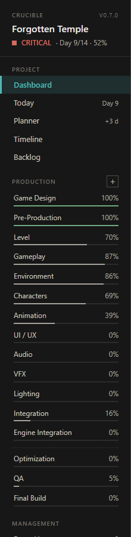 _The rail (left side)._

The rail Top: the project name, its health (ON TRACK / AT RISK / LATE / CRITICAL), the current day and overall progress. **PROJECT**: Dashboard, Today, Planner, Timeline, Backlog. The small numbers on the right are live: today's day number, how many days late the forecast is, how many backlog items you have. **PRODUCTION**: only the departments _in use_, each with a progress bar. The **+** opens the department picker (chapter 9). A dashed line separates production departments from finalization ones (Optimization, QA, Final Build…). When a department is finished, a teal "Next:" hint appears here. **MANAGEMENT**: Bugs / Issues (with the open-bug count), Search, Time log, Reports. **SETTINGS**: Project Settings.

### The header

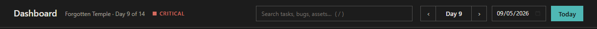
_Screen title · project · day · health · search bar · day stepper · calendar date · Today._

- **Search bar**: type anything and Crucible jumps to the Search screen with results (chapter 13). `Esc` clears it.
- **‹ Day 9 ›**: step the current day back or forward. The current day is the day the whole app reasons about ("today").
- **Date field**: jump to a calendar date inside the project.
- **Today**: set the current day from your PC's real date. Turn on "Follow the real calendar" in Settings to do this automatically on launch.

### Keyboard shortcuts

| Key | Does |
| --- | --- |
| `1` `2` `3` `4` `5` `6` | Dashboard · Today · Planner · Backlog · Bugs · Time log |
| `/` | Search (focuses the search bar) |
| `+` | Add department |
| `F` | Focus mode on the current item (chapter 23) |
| `C` | Capture a thought into the backlog |
| `Esc` | Close the item window, Focus mode or any dialog |
| `Enter` in "What did you do?" | Save the item |
| `Ctrl`+`V` in the item window | Paste an image from the clipboard as a screenshot |

Shortcuts are ignored while you are typing in a field.

## 4 · The ideas behind it (read this once)

### Project, days and capacity

A project has a start date, a duration in days (14 to 365, any number) and a number of working hours per day, on the weekdays you choose. Day 1 is the start date. Duration × hours/day on working days is your **capacity**. Everything else is measured against it.

### Departments

A department is a lane of work: Game Design, Modeling, UV, Texturing, Audio, QA… Each has a **weight** (its share of overall project progress; weights in use should add up to 100) and a position in the pipeline order. Departments can be **parked**: hidden and ignored by progress, health and the planner, with all their items kept safe. A catalog of about forty standard departments is built in; you can also create your own.

### Work items

One kind of record for everything. An item has a **type** (TASK, ASSET, BUG, DESIGN, MODELING, QA…), a **department**, an optional **parent** (so an asset can have stages under it, and a bug can hang off the stage where you found it), an **estimate** in hours, **logged time**, **progress** and a **remaining** figure, a **status**, a **priority**, an optional **class**, and for bugs a **severity**. Every change is written to the item's **history** with a timestamp; nothing is ever silently overwritten.

| Field | Values | Meaning |
| --- | --- | --- |
| Status | BACKLOG · PLANNED · TODO · IN PROGRESS · BLOCKED · DONE · CUT | BACKLOG = known but not on the plan (does not count anywhere). PLANNED/TODO = on a day. DONE requires all _required_ checklist steps and child items to be done. |
| Priority | MUST HAVE · NICE TO HAVE · CUT | Only MUST HAVE work drives health, overdue and the forecast. CUT is kept but ignored. |
| Class | S · A · B · C · D | Importance for ordering, independent of priority. S is critical, D is minor. Bugs default to S/A/C/D from their severity. |
| Severity | CRITICAL · HIGH · MEDIUM · LOW | Bugs only. Critical/high bugs are MUST HAVE and count against project health. |
| Estimate / Logged / Remaining | hours | Remaining = estimate × (1 − progress), unless you type a remaining figure yourself. Logged is the sum of your time entries. |
| Progress | 0–100 % | Your judgement. DONE forces 100. Parents show the estimate-weighted average of their children. |

### Pipelines, stages and checklists

Each department owns a **pipeline**: an ordered list of stages with default estimates (Reference → Blockout → Modeling → UV → Texturing → …). When you create an **asset** in a department, the pipeline becomes that asset's child items, chained so each stage depends on the previous one. A stage whose name matches another department in use (UV, Texturing, LOD…) is filed in that department, so department progress follows the asset's checklist. Ticking a stage in a checklist marks the real item DONE.

### Planned vs. logged

The planner books hours onto days. When you log time, Crucible compares what was booked with what happened. Estimates that keep running over are flagged as a risk.

## 5 · Dashboard

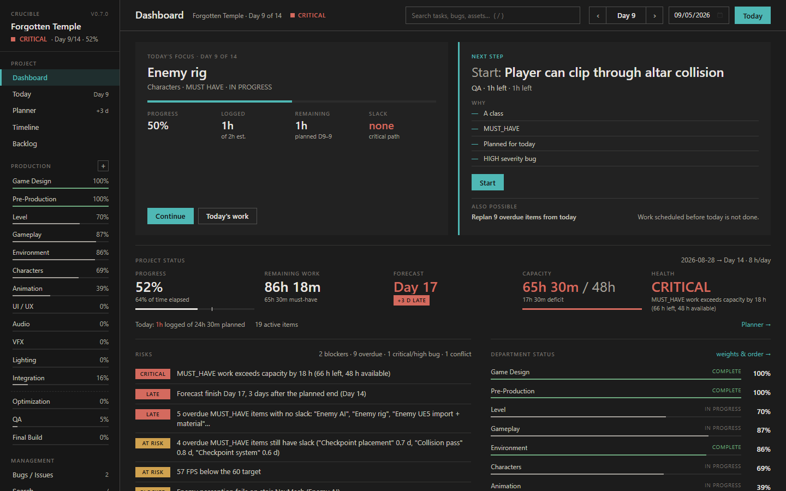
_Dashboard of the sample project, Day 9 of 14._

The Dashboard is made to be read in ten seconds. Top to bottom:

- **Today's focus**: the item you are working on (in progress, or the best candidate): progress, logged, remaining, slack, and Continue.
- **Next step**: what Crucible recommends, with the reasons, one button to act on it, and alternatives below. Chapter 9 explains where this comes from.
- **Project status**: progress (the small tick on the bar is elapsed time; if the tick is ahead of the bar you are behind), remaining work, the forecast finish day with how many days late or early, capacity used vs. available, and health with its main reason.
- **Risks**: capacity deficit, late forecast, overdue must-have items (with slack vs. no slack), blockers, high bugs, performance below target, planner conflicts. Click one to open the item.
- **Department status**: every department in use with progress and state. Click to open it.
- **Upcoming**: the next production gate (game profiles), the next department the pipeline suggests, the nearest deadline.

## 6 · Today

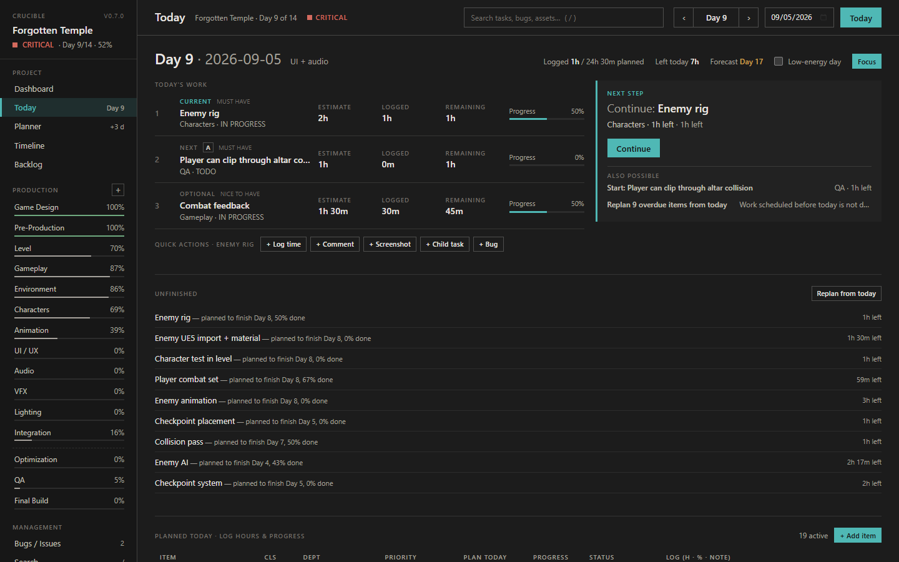
_Today: current, next and optional work, the next step, unfinished items and the logging table._

- **Today's work**: three rows: Current (the item you are on), Next (best must-have), Optional (best nice-to-have). Each shows estimate, logged, remaining and progress. Click a row to open it.
- **Quick actions** on the current item: + Log time, + Comment, + Screenshot, + Child task, + Bug. The fastest way to record work without opening anything.
- **Next step**: the same recommendation as the Dashboard, compact.
- **Unfinished**: items planned to end yesterday or earlier that are not done, and critical blockers. "Replan from today" re-spreads open work over the remaining days.
- **Planned today · log hours & progress**: every item booked on the current day, with a log row: hours, percent, note, Log. Press `Enter` in the note field to log. Status and priority can be changed inline; "Complete" appears when an item can be finished. Double-click a row to open it.
- **New work discovered**: a capture box. Anything you type goes to the backlog for later scheduling.
- **Low-energy day** (switch at the top right) and the **Focus** button: see chapter 23.

## 7 · The item window (tasks and bugs)

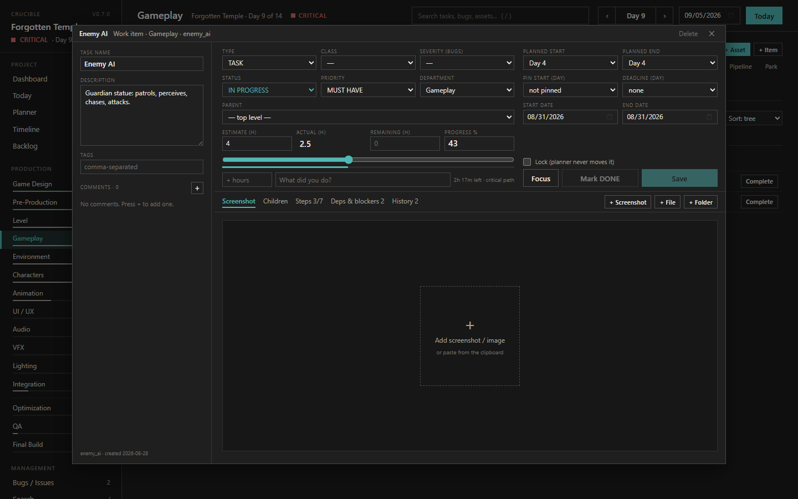
_An item opens in its own window: left column, fields on top, tabs below._

Open an item by **double-clicking its row** anywhere, clicking its title, or from a Next-step button. In the installed app each item opens as a separate window, so you can keep one open beside the main window; changes sync between windows the moment you Save.

### Left column

- **Task / bug name** and **Description**.
- For bugs: **Location** (level, engine path, asset) and **Reproduction** steps.
- **Tags**, comma-separated.
- **Comments**: press **+** to write one. Each comment shows the day and the date-time it was written and when it was last edited.

### Fields (top right)

Type, Class, Severity, Status, Priority, Department, Parent, Planned start/end (day and calendar date), Pin start, Deadline, Lock. These apply as soon as you change them.

### Time and progress

Estimate, Actual (logged), Remaining, Progress with a slider. Below it, the **+ hours** and **What did you do?** fields log a time entry. The grey text shows what the planner thinks is left and whether the item is on the critical path.

> **Save model.** Name, description, tags, hours, progress, a new comment and new screenshots are _drafts_ until you press **Save** (the button shows a dot while something is unsaved). Closing with unsaved changes asks first. Dropdowns and the Lock box apply immediately. **Mark DONE** is enabled only when every required step and child item is finished.

### Tabs

- **Screenshot**: the latest screenshot fills the area; thumbnails below switch between them. No screenshot yet? Click the dashed square, or paste an image with `Ctrl`+`V`. Image files are stored next to your project file; linked files and folders (+ File, + Folder) are only referenced and can be opened or revealed from here.
- **Children**: stages, sub-tasks and bugs under this item, as a checklist. Add a child, add a bug, or apply a pipeline template. "Save as template" turns the current children into a reusable template.
- **Steps**: a lightweight checklist inside the item. Steps marked REQ gate DONE; steps can carry a day.
- **Deps & blockers**: dependencies (must finish first) and blockers with severity. A blocker never changes status by itself; set the item BLOCKED when you cannot continue.
- **History**: the complete thread: created, time, progress, comments, screenshots, status, estimate, schedule, priority, class, severity, department moves. Nothing is deleted from it.

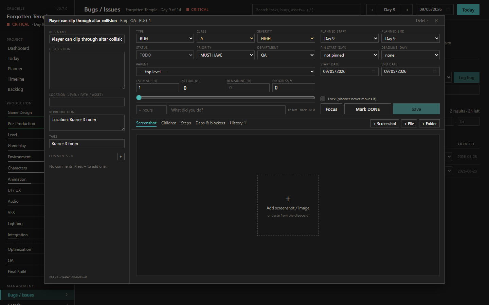
_A bug uses the same window with Location and Reproduction fields and a severity._

## 8 · Departments

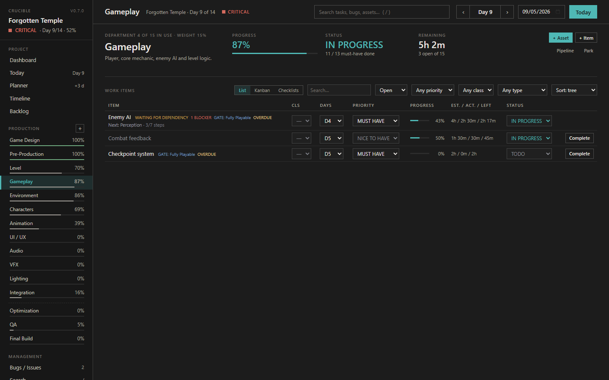
_A department: header stats, next step, and the work-item table with filters._

### Header

Progress, status (NOT STARTED / IN PROGRESS / BLOCKED / COMPLETE), remaining hours, and the buttons:

- **+ Asset**: creates a parent item and applies the department pipeline as its stages. The normal way to start a prop, a character, a level.
- **+ Item**: a single task planned for today.
- **Pipeline**: opens the pipeline editor (below).
- **Park**: hide the department without deleting anything.

### Work items: three views

- **List**: a tree: assets with their stages indented. Inline class, day, priority, progress, estimate / actual / left, status. Double-click a row to open it. Sort by tree, day, estimate, progress or newest.
- **Kanban**: Backlog · To do · In progress · Blocked · Done. Drag a card to change its status (dragging from Backlog to To do schedules it for today).
- **Checklists**: one card per asset with its stages as tick boxes. Ticking completes the real stage item; the current stage is highlighted.

Filters: search, Open / All / Backlog / Done / Bugs, priority, class, type.

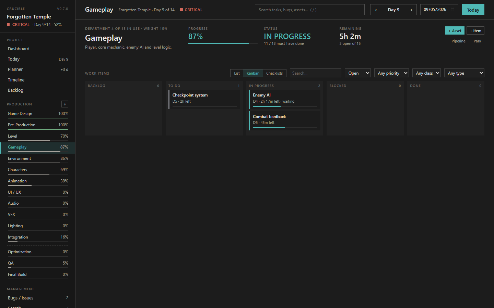
_Kanban view of the same department._

### Pipeline editor

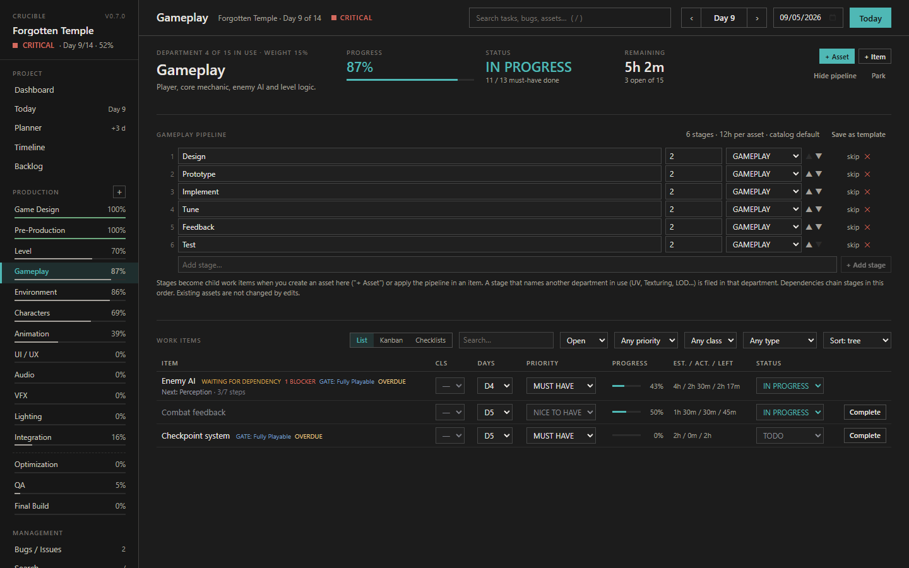
_Each department's pipeline: rename, re-estimate, reorder, skip, remove, add stages; reset to the catalog default; save as a template._

Edits apply to assets you create from now on; existing assets keep their stages. A skipped stage stays in the list but is not applied. "Save as template" makes the pipeline available in every item's "Apply pipeline template" list.

### Special panels

Game-profile projects get extra panels: **Integration** shows "fully playable", **Optimization** has the performance fields (current FPS, CPU/GPU ms, memory) against the target, **Final Build** shows the six production gates.

## 9 · Adding a department and the next-step engine

### The department picker

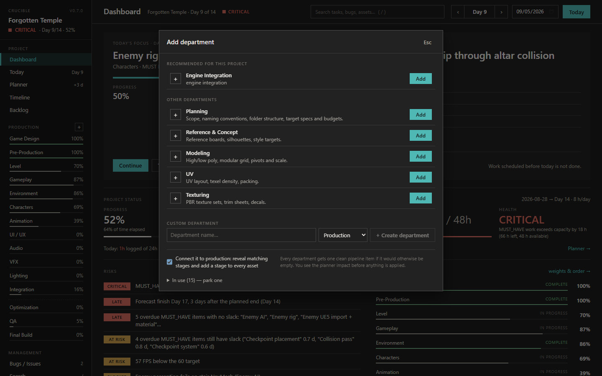
_PRODUCTION + opens the picker._

- **Recommended for this project**: departments the project description suggests, plus the next stage of the pipeline when a department is complete (marked "next stage").
- **Other departments**: the rest of the catalog. Parked departments appear here too and say so.
- **Custom department**: your own name, in Production or Finalization.
- **Connect it to production** (ticked by default): when the new department joins, existing stages that carry its name are filed into it, every asset that has no such stage gets one (depending on the asset's last stage), and those stages are put on the plan from today. Untick to add an empty department.
- **In use — park one**: park a department from here.

Nothing is added silently: you press Add. Then the impact appears.

### The impact banner

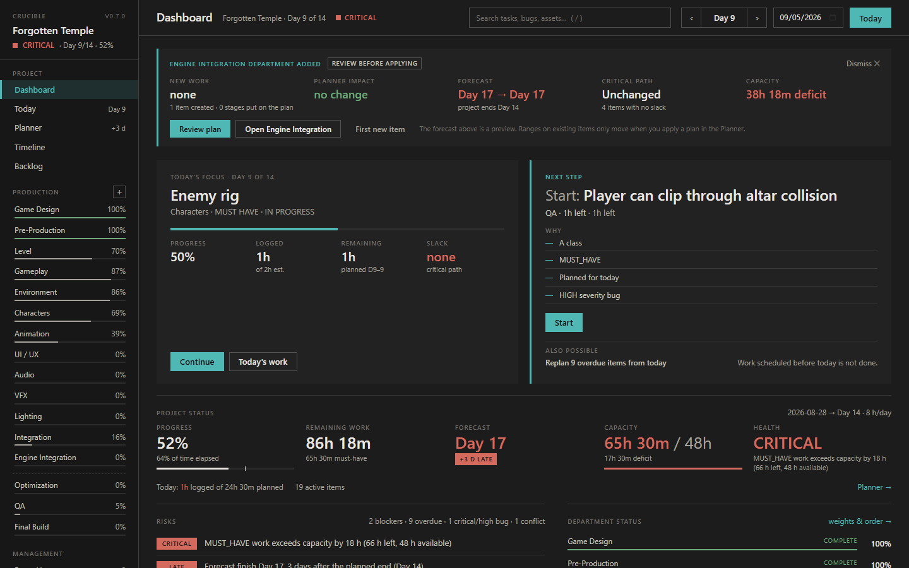
_After adding a department: new work, planner impact, forecast before → after, critical path, capacity._

The numbers are a preview: existing items only move when you apply a plan in the Planner. "Review plan" takes you there.

### How the next step is chosen

Deterministic rules, in this order. The first one that applies is _the_ next step; the rest are listed as alternatives.

1. **Resolve a critical blocker** on must-have or critical-path work.
2. **Continue** an item already in progress.
3. **Start / schedule the next stage** of an asset whose previous stage is done ("Modeling is complete").
4. **Start** the highest-ranked actionable item (class, priority, critical path, gate need, overdue, deadline, severity all score).
5. **Start a department** that follows a completed one in the pipeline and is in use but not started.
6. **Add a department** that follows a completed one but is not in use yet. You can **Ignore** these; ignored suggestions can be restored in Settings.
7. **Replan** when must-have work is overdue.
8. **Capture work** when there is nothing to do.

## 10 · Planner

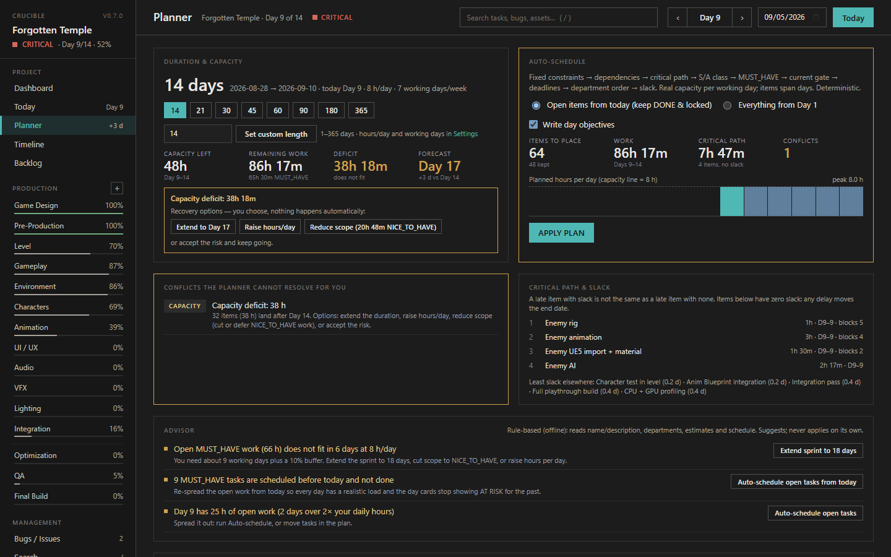
_Planner: duration, capacity, auto-schedule preview, conflicts, critical path, advisor, departments._

### Duration & capacity

Presets 14 · 21 · 30 · 45 · 60 · 90 · 180 · 365 or a custom length. Shortening never deletes work: items past the new end are pulled back to the last day and listed first so you can confirm. Capacity left, remaining work, deficit and forecast are shown; a deficit opens the recovery options: extend, raise hours/day, reduce nice-to-have work. You choose.

### Auto-schedule

The planner takes every open item (not backlog, not parked, not cut), sorts it by critical path → class → priority → gate need → deadline → department order → slack, keeps dependencies in order, then fills the days: pinned items on their day, everything else forward from today, spilling multi-hour items across days by real capacity. Locked and DONE items never move. The preview shows items placed, hours, the critical path, conflicts and a bar per day (amber = over capacity). **APPLY PLAN** writes the days onto the items and records a schedule entry in each history. "Write day objectives" fills the Timeline objectives from the departments worked each day.

### Conflicts

Things the planner refuses to hide: capacity deficit, a missed deadline, a pin on an overloaded or non-working day, a pin before its dependency, a dependency loop, work that could not be placed. Each names the item and the reason.

### Critical path & slack

Zero-slack items are listed in order; any delay on them moves the end date. Items with little slack are named below.

### Advisor

Plain-language checks with one-click fixes: weights not summing to 100, parked departments with open work, keyword-based department suggestions from your description, missing estimates, extend/shorten the duration to fit the work, overdue → replan, an overloaded day, blank objectives.

### Departments table

In use, order (▲▼), name, weight, group, description, item count. Normalize weights to 100, load a preset, add from the catalog, or remove a department (its items move to a neighbour; parking is safer).

## 11 · Timeline and Backlog

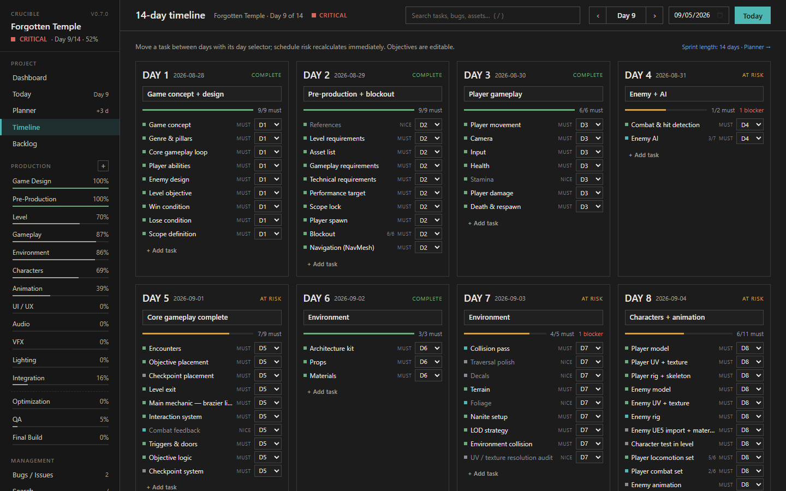
_Timeline: one card per day with its objective, must-have progress and items; weeks for long projects._

Each day card has an editable objective, the must-have completion bar, the items ending that day with a day selector to move them, and any dated checklist steps. "+ Add task" creates an item on that day.

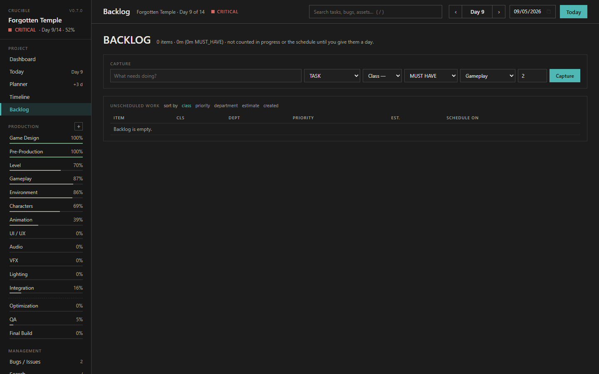
_Backlog: unscheduled work._

Capture known work fast (title, type, class, priority, department, estimate) without giving it a day. Backlog items are not counted in progress, health or the forecast until you schedule them with "Schedule on" or the planner. Sort by class, priority, department, estimate or created.

## 12 · Bugs / Issues

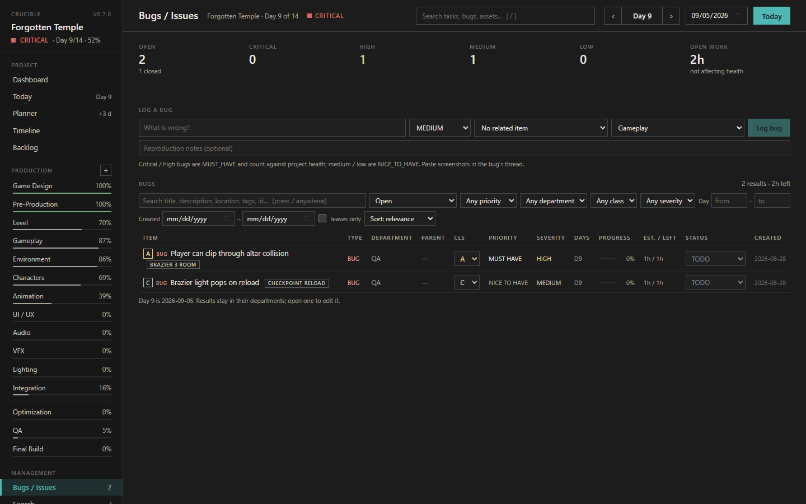
_Bugs from every department in one place._

A bug is an ordinary work item with type BUG. It can live at the top level or under the asset or stage where you found it (then "Related to" shows the parent). The counters at the top show open bugs by severity and their remaining hours, and whether they currently affect project health.

**Log a bug**: title, severity, related item (optional), department, reproduction notes. Critical and high bugs become MUST HAVE and are planned for today; medium and low are NICE TO HAVE. Screenshots go in the bug's window.

The table below is the search component (chapter 13) locked to bugs. Double-click a row to open the bug window.

## 13 · Search

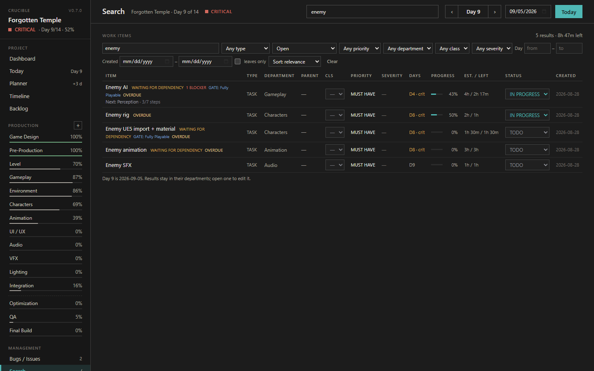
_Search across every department with filters._

Type in the header search bar from any screen, or press `/`. Matches on title (ranked first), the parent's title, description, location, reproduction notes, tags, id and department name. Several words must all match.

**Filters:** type · plan state (Open, All, Unscheduled, Planned, Planned today, Overdue, In progress, Blocked, Done) · priority · department · class · severity · planned day from–to · created date from–to · leaves only (hide parents) · sort (relevance, newest, oldest, planned day, estimate, remaining, progress, severity, class). Filters are remembered per screen. The line on the right counts results and remaining hours.

## 14 · Time log

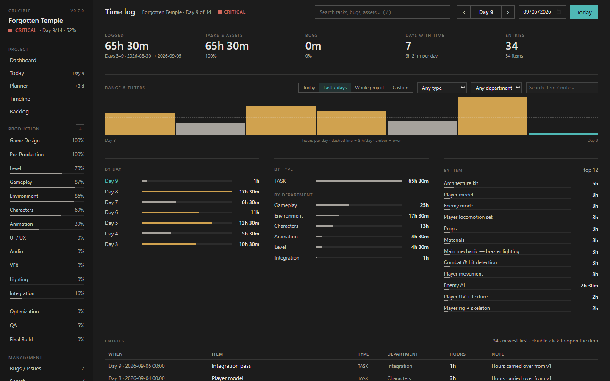
_Everything you logged: by day, by type, by department, by item, and every entry._

Every "+ hours" you log, from Today or an item window, becomes a time entry with a day, a timestamp and a note. The Time log screen adds them up so you can see where your hours actually went.

- **Totals**: logged hours in the range, split into tasks & assets vs. bugs, the number of days with time (and the average per day), and the number of entries.
- **Range**: Today, Last 7 days, Whole project, or a custom day range. Filter by type and department, or search the item name and note.
- **Chart**: hours per day; the dashed line is your hours/day setting, amber bars went over it, the teal bar is today.
- **By day · By type · By department · By item**: ranked breakdowns. Click an item to open it.
- **Entries**: the full list, newest first, with the note you wrote. Double-click a row to open the item. Negative entries are corrections.

> Time is never edited in place. To correct a mistake, log a negative amount on the same item (for example −1) with a note; both entries stay in the history.

## 15 · Reports

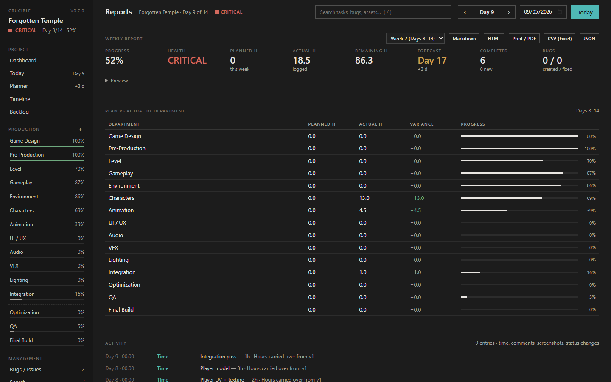
_Weekly report with exports, plan vs actual by department, and the activity stream._

- **Weekly report**: pick a week: progress, health, planned vs actual hours, remaining, forecast, completed, new, bugs created / fixed, blockers, departments, critical path, major changes, risks and recommendations. Export as **Markdown**, **HTML**, **Print / PDF**, **CSV** (all items, for Excel) or **JSON**.
- **Plan vs actual by department**: booked hours against logged hours for the week, with variance and progress.
- **Activity**: every time entry, comment, screenshot, status change and creation in the week, newest first.

## 16 · Project Settings and the New Project wizard

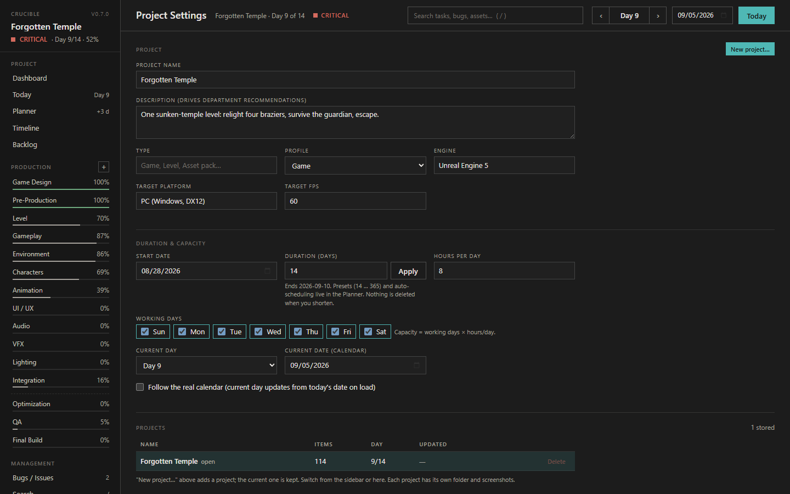
_Project Settings._

- **Project**: name, description (it drives department recommendations), type, profile (Game, Asset library, Level, Minimal, Custom), engine, platform, target FPS.
- **Duration & capacity**: start date, duration, hours per day, working days, current day, calendar date, "Follow the real calendar".
- **Projects**: every project stored on this PC — Open, Delete (moved to a trash folder, never destroyed). See chapter 21.
- **Data**: Export JSON, Import JSON, Reset to defaults (blank 30-day project with the standard departments and one clean pipeline item each), Reset to sample project, Add template to each department, Restore ignored suggestions. The line below shows where the open project is saved.
- **Claude connector**: the two setup snippets for Claude Code and the Claude desktop app. See chapter 22.

### New project wizard

_Five steps; nothing is created until the last one._

1. **Basic info**: name, description, type, profile, engine, platform, start date, hours/day, duration (presets or custom), working days.
2. **Production structure**: the departments recommended from your description, each with the reason. Untick what you don't need; add optional ones.
3. **Pipeline templates**: each department's pipeline, editable; choose which departments get a starter item; optionally list your first assets (one per line) and they are created with the Environment or Modeling pipeline.
4. **Planner**: estimated work, capacity, conflicts, critical path and forecast for the project as it would be created.
5. **Review**: summary, then **Create project**. The new project is added next to the current one and opened. Tick "Replace the current project instead" if you really want to overwrite it (export first).

## 17 · A normal working day

  1. Open Crucible. Press **Today** in the header if the day is not right (or let it follow the calendar).

  2. Read the Dashboard: focus, next step, health. Ten seconds.

  3. Go to **Today** and start on the Current row. Work.

  4. When you stop, record it: hours and a one-line note in the log row (or in the item window: + hours, What did you do?, a screenshot of the result, **Save**). Adjust the progress slider honestly.

  5. Found a problem? **+ Bug** on Today, or "Create bug" from the item. It lands under the item you were on.

  6. Finished a stage? Tick it in the checklist or Mark DONE. The next stage becomes the next step; if it belongs to a department you have not added yet, the picker offers it with the plan impact.

  7. Something slipped? "Replan from today" on Today or the Dashboard, or APPLY PLAN in the Planner. Read the forecast. If it is red, choose a recovery option; Crucible never cuts work for you.

  8. End of the day: check the Time log to see where the hours went. End of the week: Reports → export or print the weekly report.

## 18 · Your data: where it lives, backups, sharing

- Each project is one file, **project.json**, in its own folder: **%APPDATA%\dev.armaan.crucible\projects\\**. Its screenshots are in an **attachments** folder inside that project folder. Linked files and folders stay where they are; only their paths are kept.
- Crucible saves automatically a quarter of a second after every change and keeps the previous version as **project.json.bak**.
- **Backup**: Settings → Export JSON writes a copy anywhere you like. Do this before Reset or Import.
- **Move to another PC**: export, copy the JSON (and the attachments folder if you want the screenshots), import there.
- **Old files**: projects from earlier Crucible versions open fine; they are upgraded in place and nothing is dropped. Upgrading from 0.4 moves your single project into the new **projects** folder on first launch; old screenshots stay where they were and keep working.
- **Deleted projects** go to **projects\_trash**; copy the folder back out to restore one.
- No data ever leaves your computer.

## 19 · Questions and answers

**Why is my department at 0 % when I have done work?**

Only items on the plan count. Backlog items (including the "— template" items) are ignored until they get a day. Also check the department is not parked.

**Mark DONE is greyed out.**

The item still has required steps (Steps tab, marked REQ) or open child items. Finish or cut them, or untick REQ on a step you do not need.

**Remaining hours look wrong after I logged time.**

Remaining is derived from progress, not from logged time. Move the progress slider, or type a remaining figure directly.

**The forecast is later than the project end.**

That is the planner being honest: open must-have work does not fit the remaining capacity. Extend the duration, raise hours per day, defer nice-to-have work, or accept the risk.

**I added a department but the items did not move.**

The impact banner is a preview. Go to the Planner and APPLY PLAN to write new days onto the items.

**A suggestion keeps coming back.**

Press Ignore on it. Ignored suggestions can be restored in Settings → Data.

**Where did my "Open" button go?**

Double-click any row, or click the title.

**Can two people use it?**

Not at the same time. Share the JSON export; team fields exist in the data for a future version.

## 20 · Feature checklist

| Area | Features |
| --- | --- |
| Project | Name, description, type, profile, engine, platform, target FPS · start date · duration 1–365 days with presets · hours/day · working days · current day and calendar date · follow real calendar |
| Departments | Catalog of ~40 · presets (game, asset library, minimal) · custom departments · weights and normalize to 100 · order · production / finalization groups · park / un-park · remove with item move · recommendation from description · next-stage suggestion |
| Pipelines | Per-department editable stages (add, rename, estimate, type, reorder, skip, remove, reset) · save as template · apply as asset checklist · stages filed into matching departments · reveal / extend / schedule stages when a department is added |
| Work items | Types task / asset / bug / design / modeling / gameplay / improvement / polish / QA / future · parent-child hierarchy with rollups · status, priority, class, severity · estimate, logged, remaining, progress · planned start/end, pin, deadline, lock · dependencies · blockers · tags · checklist steps with day and required flag · location and reproduction for bugs · comments with edit history · screenshots (file or paste) · linked files and folders (open / reveal) · full timestamped history · delete with children |
| Item window | Separate window per item (installed app) · draft-then-Save · Mark DONE with gate · Screenshot / Children / Steps / Deps & blockers / History tabs · apply pipeline template · save children as template |
| Planning | Deterministic scheduler with real capacity · critical path and slack · dependencies · pins, locks, deadlines honoured · conflicts explained · open-from-today or everything-from-day-1 · frozen per-day bookings · day objectives · forecast, variance, deficit · recovery options · advisor rules · add-department impact preview |
| Daily | Today's focus · next-step engine with reasons and Ignore · current / next / optional · quick actions (time, comment, screenshot, child, bug) · unfinished carry-over · replan from today · logging table · quick capture · Focus mode with timer · low-energy day · capture key |
| Reading | Fonts: system, Atkinson Hyperlegible, OpenDyslexic · text size · line and letter spacing · dark, warm and paper themes · calm labels · reduced motion · "Break it down" step suggestions |
| Time | Time entries with day, timestamp and note · totals by day / type / department / item · today, last 7 days, whole project or custom range · hours-per-day chart against your daily capacity · corrections by negative entries |
| Views | Dashboard · Today · Planner · Timeline (days / weeks) · Backlog · Department list / kanban (drag) / checklists with filters and sort · Bugs · Search with 11 filters · Time log · Reports |
| Reports | Weekly report (progress, health, planned vs actual, completed, new, bugs, blockers, departments, critical path, changes, risks, recommendations) · Markdown, HTML, print/PDF, CSV, JSON · plan vs actual by department · activity stream |
| Data | Several projects side by side (switch, open, delete to trash) · auto-save with .bak · export / import JSON · schema upgrades from older versions · reset to defaults or sample · templates saved with the project · local only |
| Claude | Local connector (MCP) for Claude Code and the Claude desktop app: create projects, add departments, create tasks / assets / bugs, update, set status and progress, log time, comment, run the planner, read health, next steps, today, search |
| Keyboard | 1–6 screens · / search · + add department · F focus · C capture · Esc close · Enter to save/log · paste image |

Crucible 0.7 · © 2026 Armaan · All rights reserved. Compiled builds are shared for personal use; the software is not open source.

## 21 · Several projects

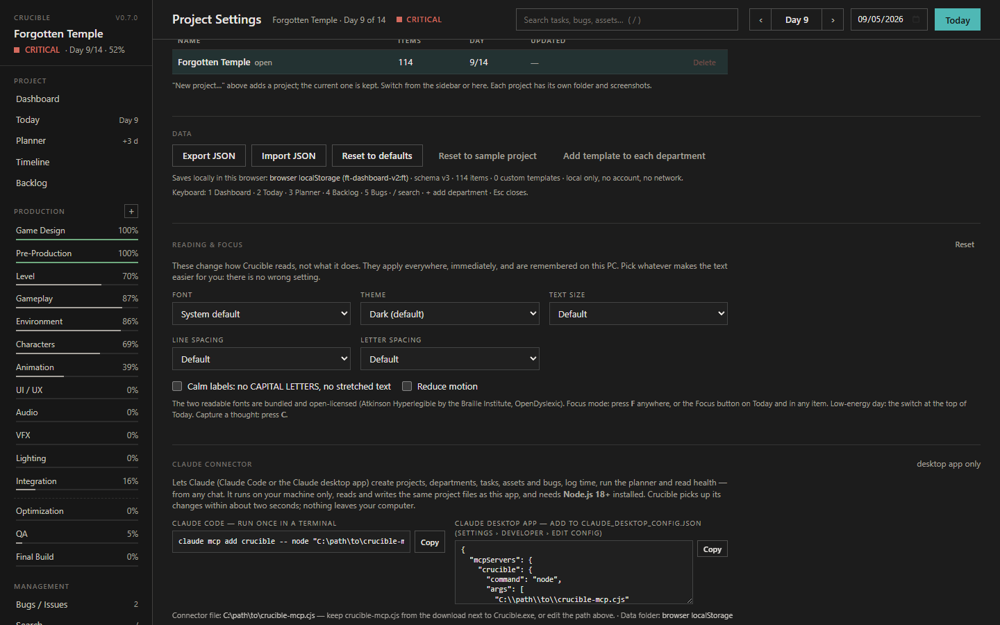
_Project Settings → Projects: everything stored on this PC._

Crucible keeps as many projects as you like, each in its own folder. One is open at a time.

- **Create**: Project Settings → **New project…** (the wizard). The new project is added and opened; the one you were in stays as it was.
- **Switch**: click the project name at the top of the rail — it becomes a drop-down as soon as you have more than one project — or press **Open** in the Projects table. Item windows of the previous project can stay open; they keep saving to that project.
- **Delete**: the Projects table. The folder is moved to **projects\_trash**, so nothing is lost. The open project can only be deleted when another one exists.
- Import JSON, Reset to defaults and Reset to sample still act on the **open** project.

## 22 · The Claude connector

_Project Settings → Claude connector: copy one of the two snippets._

The download contains a second file, **crucible-mcp.cjs**. It is a small local program (an MCP server) that lets Claude work inside your Crucible data from any chat: "create a 60-day asset-pack project with these departments", "log these playtest notes as bugs with severity", "what should I do today?", "log 2 hours on the altar model". Claude Code and the Claude desktop app both support it.

### Setup

  1. Install **Node.js 18 or newer** (nodejs.org) if you do not have it. Claude Code already needs it.

  2. Keep **crucible-mcp.cjs** next to **Crucible.exe**. The Settings box shows "connector file found" when it is in place.

  3. **Claude Code**: copy the first snippet and run it once in a terminal. **Claude desktop app**: copy the second snippet into Settings → Developer → Edit config (_claude_desktop_config.json_) and restart the app.

  4. Ask Claude for something. It sees the projects on this PC and works on the current one unless you name another.

### What it can do

| Read | Write |
| --- | --- |
| list projects · project summary · search items · one item with history · health and forecast · next steps · today's ranked work · recommended departments | create project (departments from the description, or ones you name, with pipeline templates and first assets) · add department (returns the plan impact) · create task / asset with pipeline / bug · update fields · set status · set progress · log time · add comment · run the planner (open or all) |

### How it stays safe

- Everything runs on your machine. The connector reads and writes the same project files as the app; no server, no account, nothing leaves the PC.
- Every change it makes is written into the item history with author **Claude**; items it creates carry the tag **via-claude**, so you can search for them.
- Crucible notices the file change within about two seconds and reloads. If you were typing at that exact moment, the app keeps the file's version and tells you.
- The connector cannot delete projects or items.

## 23 · Reading & focus: fonts, themes, Focus mode, low-energy days

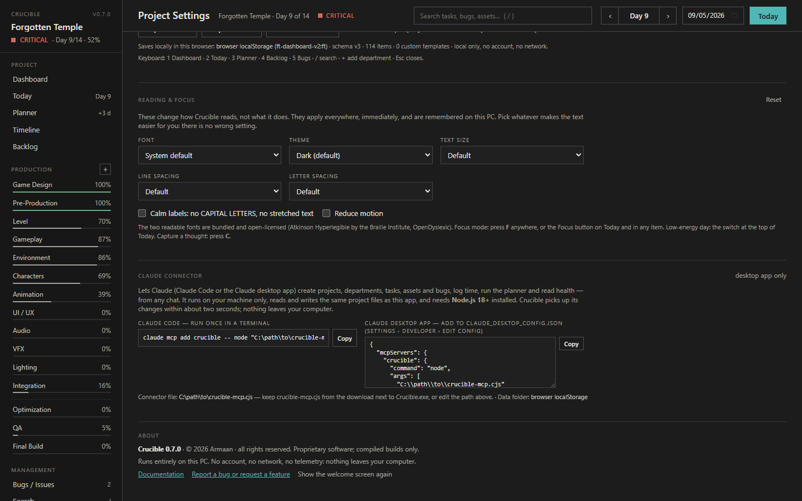
_Project Settings → Reading & focus. Every choice applies at once, everywhere, and is remembered on this PC._

Crucible is built to be usable on days when reading is hard and days when starting is hard. None of this changes what the app does with your project; it changes how it reads and how much of it you see at once. There is no wrong setting.

### Reading preferences (Project Settings → Reading & focus)

| Setting | What it does |
| --- | --- |
| Font | **System default**, **Atkinson Hyperlegible** (letters that are hard to confuse: I / l / 1, O / 0) or **OpenDyslexic** (heavier bottoms so letters do not flip). Both are bundled, no download. |
| Theme | **Dark** (default), **Warm** (dark with softer contrast and less blue) or **Paper** (light, cream background, for people who read better on light surfaces). |
| Text size | Scales the whole app from 90 % to 145 %. Windows and tables reflow. |
| Line spacing · Letter spacing | More air between lines and between letters. Often the single most helpful change for dyslexia. |
| Calm labels | Turns off the CAPITAL-LETTER section labels and the stretched tracking. Same words, lower volume. |
| Reduce motion | No transitions or animations. |

### Focus mode

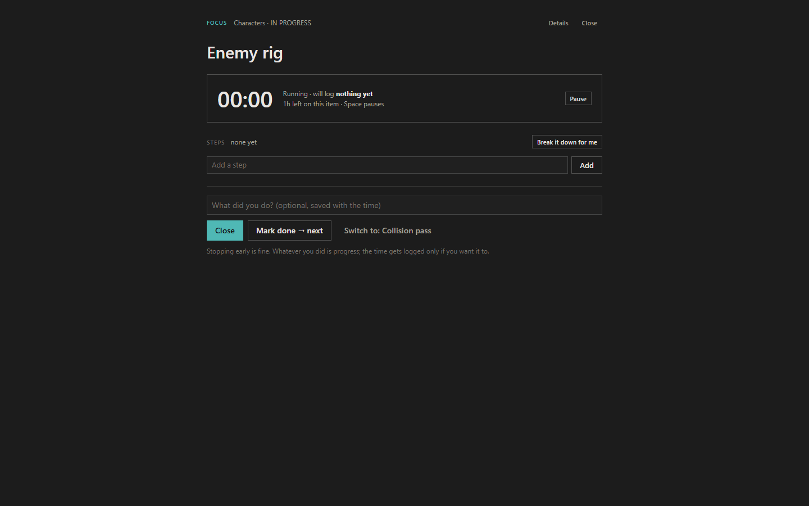
_Focus mode: one item, its steps, a timer. Nothing else on screen._

Press `F` anywhere, or click **Focus** on Today or inside any item. The screen shows one item only: its title, description, steps and a running timer. Space pauses the timer. What you can do from there:

- **Tick steps** as you go. "Just the next one" shows the single step to do now.
- **Break it down for me** (when an item has no steps): adds five or six small, ordered steps suited to the item type: tasks, bugs or assets. Edit them freely; they are yours.
- **Log & close**: the time on the timer is rounded to the nearest quarter hour and logged with your note. Under three minutes logs nothing. **Close** or `Esc` leaves without logging.
- **Mark done → next**: finishes the item (logging the time first) and moves straight to the next best item.
- **Switch to**: jumps to the next best item without finishing this one.

### Low-energy day

The switch at the top of Today. When it is on, Today hides the numbers, the forecast, the unfinished list and the table, and shows **one small thing**: the item with the least time left that fits in about half an hour (or the smallest item overall). **Something else** rotates to the next candidate; **Start in Focus** opens it in Focus mode. "Show everything anyway" brings the full screen back for the moment; the switch stays on until you turn it off. Doing that one thing counts as a full day.

### Capture

Press `C` on any screen, type the thought, press `Enter`. It goes to the backlog, unscheduled, so it is out of your head without becoming today's problem. Sort it later from the Backlog.

### Break it down (item window)

In the item window, Steps tab, **Break it down** proposes steps in a text box, one per line. Change, reorder or delete lines, then **Add these steps**. Pasting your own list works the same way; numbering and bullets are stripped.
